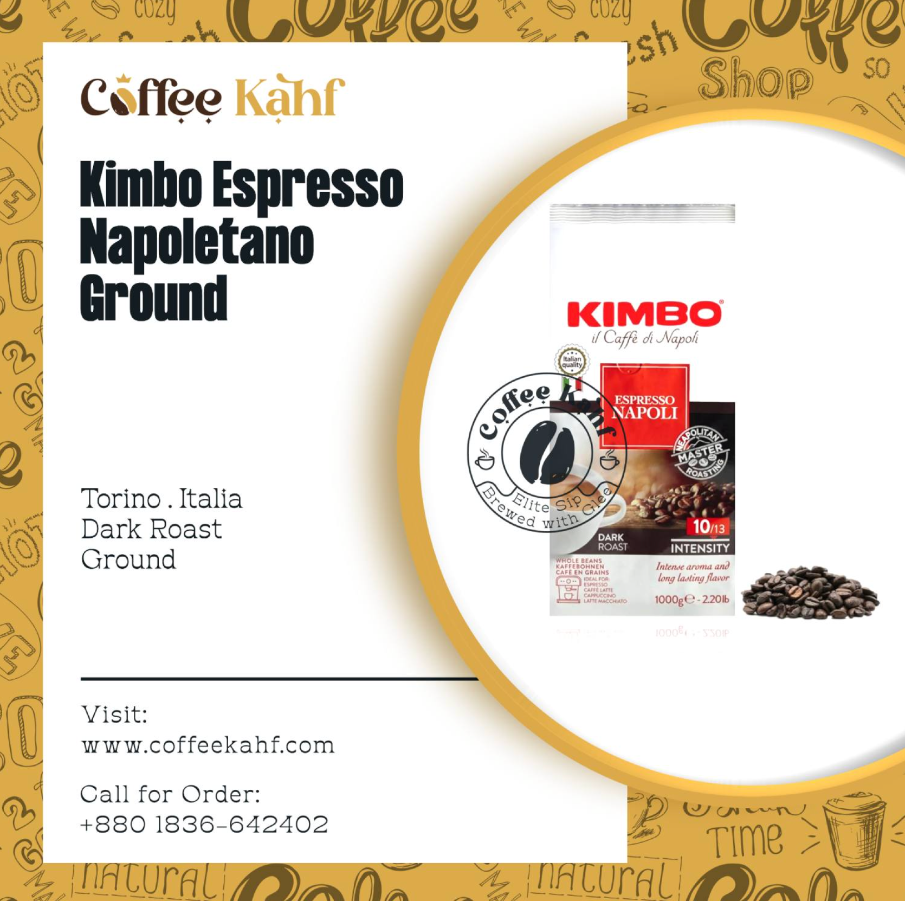
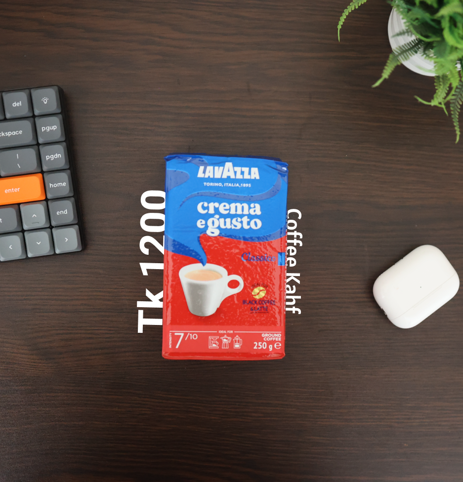

এই গল্পের প্রথম পর্ব পড়তে [এখানে ক্লিক করুন](http://localhost:1313/posts/backend-developer-starts-a-coffee-business/)

---
একদিন নর্থ এন্ডের সব থেকে পুরনো ব্রাঞ্চ শাহজাদপুরে কফি খেতে খেতে মহিউদ্দিন ভাইয়ের কাছ থেকে জানতে পারলাম তিনি তার নতুন কফি বিজনেসের জন্যে কিছু মার্কেটিং প্লান নিয়ে চিন্তা করছেন।

এজন্যে সর্বপ্রথম এবং বাংলাদেশের জন্য জাতীয় মার্কেটিং মিডিয়া হিসেবে উনি ফেসবুককেই বেছে নিয়েছেন। তাই উনি একটা ফেসবুক পেজ সাজাইছেন কফি রিলেটেড বিভিন্ন প্রোডাক্ট দিয়ে।

আমি বরাবরই যে কারো, যেকোনো নতুন বিজনেস নিয়ে সবসময় আগ্রহ প্রকাশ করি। আর, আমার আগ্রহের একদমই কেন্দ্রবিন্দুতে থাকে সেই বিজনেসগুলোর মার্কেটিং প্লান। মহিউদ্দিন ভাইয়ের ক্ষেত্রেও তেমনটাই হলো। জানতে চাইলাম উনার এই বিজনেস নিয়ে মার্কেটিং প্লানটা কি।

উনি যা উত্তর দিলো তা অনেকটা এরকম যে, "কাছের ভাই ব্রাদারদের কাছে বিক্রয় ছাড়া।" উনার আপাতত কোন মার্কেটিং প্লান নাই

আমি অবাক হলাম। সাধারনত একটা বিজনেসের জন্যে একটা শক্তপক্ত মার্কেটিং প্লান প্রয়োজন। আর, যদি মার্কেটে সেই বিজনেসের কম্পেটিটর থাকে তাহলে তো কথাই নায়। সলিড একটা মার্কেটিং প্লান ছাড়া গ্রো করা অনেক কঠিন। 

মার্কেটিং প্লান নিয়ে আমি নিজেও অনেক পড়াশোনা করার চেষ্টা করি। আপাতত, আমার ফিজিকাল প্রোডাক্ট সেল করার মত তেমন কোন বিজনেস নাই। এবং, আমার একান্তই নিজে থেকে সেরকম ব্যবসা টাইপ কিছু কখনো শুরুও করা হয়নি।

তবুও, সবসময় বিভিন্ন বিজনেসের কেইস-স্টাডি পড়তাম। বিভিন্ন মার্কেটিং ট্যাকটিসের সম্পর্কে যতটুকু সম্ভব ধারণা রাখার চেষ্টা করতাম। কেনো জানি ভাল লাগতো ব্যাপারটা। আর ভাবতাম একদিন যদি বিজনেস করিই তাহলে এগুলো জানা প্রয়োজন। এই ভাবনা থেকেই হোক কিংবা অন্য কারনেই হোক, বিজনেস সাকসেস স্টোরি আমি সবসময় একাগ্র-চিত্তে শুনতাম ও পড়তাম।

যাইহোক, এবার আসি মহিউদ্দীন ভাইয়ের ফেসবুক পেজের দিকে। উনি পেজে ডিরেক্ট বিভিন্ন ব্র্যান্ডের কফির যেই ইমেজ গুলো অনলাইনে পাওয়া যায় সেগুলাই সরাসরি পোস্ট করেছেন। যেটা, একদমই উনার [Coffee Kahf](coffeekahf.com?ref=walidashik) এর ব্র্যান্ড ভ্যালু কমিয়ে ফেলেছে। 

আপনি যদি ইভেন রিটেইল সেলারও হন, এখন আপনার কোন কিছু বিক্রয় করতে সর্বপ্রথম যেটা লাগবে সেটা হচ্ছে "ট্রাস্ট"। আর সেই ট্রাস্ট প্রায় পুরোটাই ভায়োলেট করবে যদি আপনি আপনার ফেসবূক পেজে এরকম ছবি আপ্লোড করেন যেখানে অনেক নয়েজ থাকে।

নিচের ছবিটাতে Kimbo কফি টা ছিল প্রোডাক্ট সো-কেজ কিন্তু ছবির ৮০% জায়গা নিয়ে নিচ্ছে বিভিন্ন লগো ব্র্যান্ড নেম যেটা মেইন প্রাইয়োরিটিকে নেগলেক্ট করতেছে। আর এর উপর দেখা যাচ্ছে, কিম্বো কফিটা হোয়াইট মোড়কে আর এই হোয়াইট মোড়কের ব্যকাগ্রাউন্ডও আবার হোয়াইট। সো, প্রোডাক্ট টা কোনভাবেই হাইলাইটস হচ্ছে না। আর, আপনি যদি ঠিকোঠাক প্রোডাক্ট সো-কেজ না করতে পারেন তাহলে আপনার সেল যেমন কমবে, ব্র্যান্ড ভ্যালুও ততই ড্রপ করতে থাকবে। 

সেল কমে গেলে টাকা-পয়ষা খরচ করলেই কিছু সময়ের সেটা বাড়ানো সম্ভব তবে ব্র্যান্ড ভ্যালু যদি কমে যায় সেটা সহজে আর বাড়ানো যায় না। এজন্যে একটা ব্র্যান্ড এর তার ব্র্যান্ড-ইমেজ নিয়ে বেশ কন্সাস থাকা লাগে। 

আপনি যদি নাইকি, এপোল, কোকাকোলা কিংবা দেশীয় নামীদামী  ব্র‍্যান্ড এর এডস গুলো দেখেন তাহলে দেখবেন খুবই সিম্পল একটা ইমেজ যেটার সাথে তাদের ব্র‍্যান্ড এর মেসেজ ক্লিয়ার।

এমনকি, অনেকাংশে এমনো যে শুধু একটা হোরাইজনের পিকচার যেখানে কোন লগো-টগো নাই, দেখেই বলে দেওয়া যায় এইটা কোন ব্র‍্যান্ডকে মিন করছে। এজন্যে দেখবেন বেশ কিছু ব্র‍্যান্ডের ভিন্ন ভিন্ন ফন্ট(ফনেটিক টাইপোগ্রাফি) আছে।

যেনো আপনি শুধু কয়েকটা শব্দের দিকে তাকিয়েই বলে দিতে পারেন এইটা কোন ব্র‍্যান্ডকে রিপ্রেজেন্ট করছে।

মহিউদ্দিন ভাইয়ের প্রোডাক্টের ছবিগুলো এর পুরোটাই বিপরীত। 
এসব দেখে-টেকে আমি মহিউদ্দীন ভাইকে বললাম, আজ থেকে আপনার কফি কাহফের মার্কেটিং এর দায়ীত্ব আমি নিলাম। পুরো বিনা পারিশ্রমিকেই আমি টুকটাক কিছু করার চেষ্টা করবো। অবশ্য এতদিনে আমি উনাকে বেশ কিছু ব্যাপারে ফিডব্যাকও শেয়ার করেছি। 

উনি অনেকটা হাফ ছেড়ে বাচলেন বলে মনে হলো তখন। পরে যেটা বুঝতে পারলাম, যেহেতু উনি একজন ব্যকএন্ড ডেভেলপার, উনার পক্ষে এই ভিজুয়্যাল জিনিশপাতি নিয়ে কাজ করা বেশ চ্যালেঞ্জিং ছিল।

মহিউদ্দীন ভাইয়ের একটা গুনের কথা বলি, যদি এমন হয় [coffeekahf.com](coffeekahf.com?ref=walidashik) ওয়েবসাইটে কোনো বাগ বা ইম্প্রুভমেন্ট লাগবে তাহলে সেটা উনি ঝটপট একদিনেই সলভ করে ফেলেন। 
ফুললি ইঞ্জিনিয়ারিং মাইন্ডসেট। 
আর, যদি বিজনেস রিলেটেড কোন ব্যপার থাকে তাহলে সেটা কেনো জানি ডিলে-আর-ডিলেই হতে থাকে। এমনো কতকগুলো রাত গেছে উনি অফিস থেকে এসেই সারারাত এমনকি ভোর ফজর পর্যন্ত Coffee Kahf এর ব্যাকএন্ড-ফ্রন্টেন্ড নিয়ে কাজ করে গেছেন।

- - - -

আমি উনার কাছ থেকে ফেসবুক মেটার এক্সেস নেওয়ার পর শুরু করলাম কিছু ভিজ্যুয়াল জিনিশের পরিবর্তন আনার। সর্বপ্রথম পরিবর্তন করলাম ফেসবুকের পোস্ট এর ইমেজ গুলা।

নিজের ডেস্কের সামনে বিভিন্ন আংগিকে কফির সাথে বই-মাউস-কিবোর্ড-ম্যাক প্রপস আকারে রেখে ছবি তুললাম বেশ কিছু। 

সেসব ছবিই সিডিউল পোস্ট করলাম টানা ১ সপ্তাহের জন্যে। প্রথম ছবিটা পাবলিশ হবার পরই দেখলাম আগের সব রেকর্ড ভেঙে সব থেকে বেশি লাইক পড়েছে। ১৫ টা লাইক টোটাল যেখানে আগের পোস্টে সর্বোচ্চ থাকতো ২-৩ টা লাইক। তারমধ্যে আবার একটা মহিউদ্দিন ভাইয়ের আর বাকী দুটো আমার। একটা লাইক আমার আইডি থেকে এবং আরেকটা লাইক আমার বউয়ের আইডি থেক। :D 

সেই হিসেব করলে এটা ছিল আমাদের জন্যে একটা মাইলফলকের মত।

এই সোশ্যাল মিডিয়ার দায়িত্ব নেওয়ার পর আমি সবসময়ই ভাবতে থাকতাম কিভাবে কফি কাহফের মার্কেটিং করা যায়। সবসময় মাথার মধ্যে ঘুরপাক খেতো কিভাবে আর ৫ জন মানুষের কাছে রিচ করা যায়।

একদিন কি যেনো এক পডকাস্ট শুনতে শুনতে মহিউদ্দিন ভাইকে বললাম, কিছু কফি গিভ-এওয়ে দিতে। কিছু আসে পাশের সেলিব্রেটি ভাই ব্রাদারদের আমরা ফ্রি কফি প্যাকেজ দিলাম। ক্ষেত্র বিশেষে করো করো কফি প্যাকেজের মূল্য ৫ থেকে ৮ হাজার টাকায় গিয়ে দাঁড়াল। 

হেনরি ফোর্ডের একটা মার্কেটিং নিয়ে কথা আছে, 

> A man who stops advertising to save money is 
> like a man stops a clock to save time.

এই মতদর্শের উপর বেজ করে অমরা সবে মাত্র শুরু করা একটা কফি বিজনেসের জন্যে পুরো ফ্রি ২০ হাজার টাকার মত কফি মানুষজনকে গিফট দেওয়ার কথা চিন্তা করেছিলাম।

এই গিভ-এওয়ে করে যে আমরা খুব বেশি মার্কেটিং এ সফলতা পেয়েছিলাম তা না। তবে, এই গিভ-এওয়েটা একেবারেই বিফলে যায়নি। 

[Hasan Abdullah](https://www.linkedin.com/in/abdullah-al-hasan-376030b1/) ভাই পরবর্তীতে আমাদের নিয়ে উনার ফেসবুকে একটা স্ট্যাটাস দিয়েছিলেন যেটার মাধ্যমে অমরা বেশ কিছু কাস্টমার পাই। 

আর, সবে মাত্র শুরু হওয়া একটা অনলাইন কফি বিজনেস যার আবার ফেসবুক পেজে মাত্র শ-খানেক লাইক আছে সেই পেজকে যখন হাসান ভাই শেয়ার করেন তখন লাইক কম থাকা সত্ত্বেও একটা ট্রাস্ট তৈরি হয়। আমাদের এই গিভ-এওয়ের সব থেকে  বড় অর্জন বলা যায় এইটাই।

------

এটা কেবল গল্পের শুরু। আগামী পর্বে আমি লিখবো কিভাবে আমি মহিউদ্দিন ভাইকে রাজী করাইলাম আমাকে তার বিজনেস পার্টনার হিসেবে নিতে। এবং, আমি শেয়ার করবো আমাদের প্রথম মার্কেটিং সাকসেস এর স্টোরি। এই ব্লগ সিরিজে আমি সেয়ার করতে যাচ্ছি, সফটওয়্যার ইঞ্জিনিয়ার হয়েও কিভাবে আপনি একটা বিজনেস শুরু করতে পারেন এবং শুরু করলে কি কি চ্যালেঞ্জ ফেস করতে পারেন সেই গল্প... 

checkout our website
[coffeekahf.com](coffeekahf.com?ref=walidashik)

